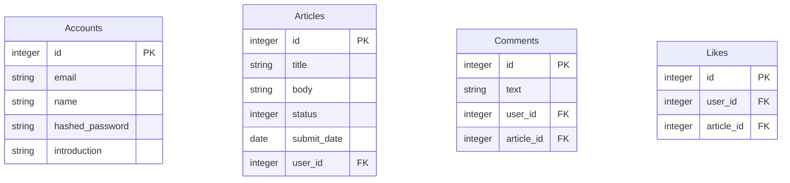

# Blog App ER図

```mermaid
erDiagram

Accounts {
  integer id PK
  string email
  string name
  string hashed_password
  string introduction
}

Articles {
  integer id PK
  string title
  string body
  integer status
  date submit_date
  integer user_id FK
}

Comments {
  integer id PK
  string text
  integer user_id FK
  integer article_id FK
}

Likes {
  integer id PK
  integer user_id FK
  integer article_id FK
}
```

※メモ：追加課題でtagを実装させるのいいかも