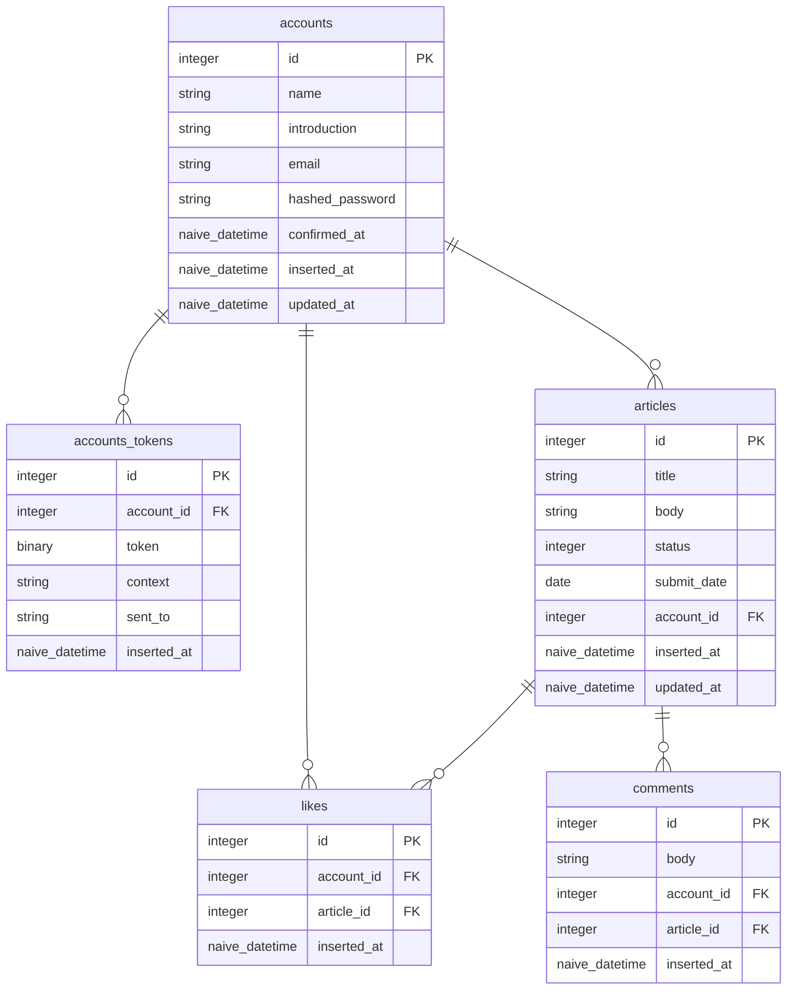

# Phoenix LiveView でブログアプリを作ろう - 機能作成編

ここでは`Phoenix LiveView`を使用してブログアプリの機能を作成します。

## ここで学べること

- LiveView用のルートの作成

- Liveの作成

- LiveViewのHTMLテンプレートの作成

- LiveViewのイベントを使用したDOMの操作

- コンポーネントの利用（formなど）

- 自作コンポーネントの作成

- on_mountについて

## プロジェクトの作成

プロジェクトの作成をします。

```bash
$ mix phx.new blog_app
```

## 認証機能の追加

以下のコマンドで認証機能を追加します。またLiveViewで作成をします。

```bash
$ mix phx.gen.auth Accounts Account accounts
```

accountsテーブルに`name`と`introduction`フィールを追加する

## テーブルとスキーマの作成

今回以下の図のテーブルを作成する



それでは、`articles`テーブルとスキーマを以下のコマンドで作成します。

```bash
$ mix phx.gen.schema Articles.Article articles title:string body:text status:integer submit_date:date account_id:references:accounts
```

`articles`テーブルのマイグレーションファイルを修正します。

`articles`スキーマを修正します。

続いて`comments`テーブルとスキーマを以下のコマンドで作成します。

```bash
$ mix phx.gen.schema Comments.Comment comment body:text account_id:references:accounts article_id:references:articles
```

`comments`テーブルのマイグレーションファイルを修正します。

`comments`スキーマを修正します。

最後に`likes`テーブルとスキーマを以下のコマンドで作成します。

```bash
$ mix phx.gen.schema Likes.Like likes account_id:references:accounts article_id:references:articles
```

`likes`テーブルのマイグレーションファイルを修正します。

`likes`スキーマを修正します。

## ホームページ（記事一覧）の作成

### ルートの作成

### on_mountについて

### Liveの作成

### テンプレートの作成

## シードデータの作成

### シードデータでアカウントの登録をする

### シードデータで記事を登録する

### シードデータでコメントを登録する

## ホームページに検索機能を追加する

### Ecto.QueryAPI.like/2 関数を使用して検索用関数の作成をする

### テンプレートに検索用のフォームを作成する

## 記事ページの作成

### 記事の表示

### いいね!する機能の作成

### コメント機能の作成

## マイページの作成

### 自作コンポーネントの作成

## 記事作成、編集ページの作成

### live_actionで表示する内容を変える


※メモ：defat, info, likesの内容をLiveComponentにする